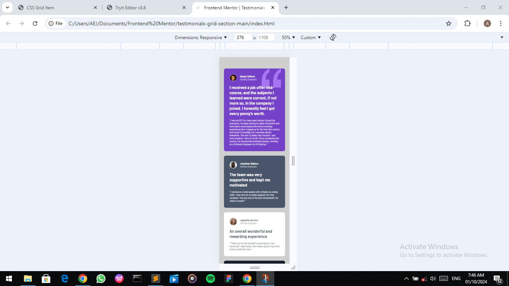
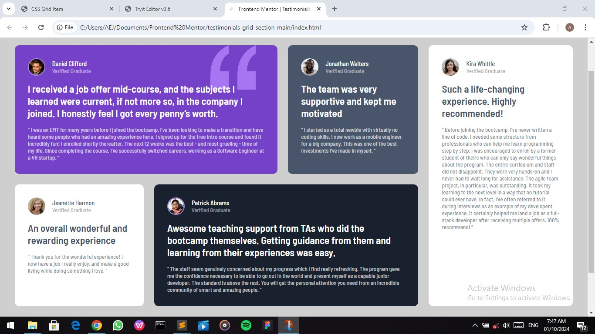

# Frontend Mentor - Testimonials grid section solution

This is a solution to the [Testimonials grid section challenge on Frontend Mentor](https://www.frontendmentor.io/challenges/testimonials-grid-section-Nnw6J7Un7).

## Table of contents

- [Overview](#overview)
  - [The challenge](#the-challenge)
  - [Screenshot](#screenshot)
  - [Links](#links)
- [My process](#my-process)
  - [Built with](#built-with)
  - [What I learned](#what-i-learned)
  - [Continued development](#continued-development)
  - [Useful resources](#useful-resources)
- [Author](#author)
- [Acknowledgments](#acknowledgments)


## Overview

### The challenge

Users should be able to:
- View the optimal layout for the site depending on their device's screen size

### Screenshot




### Links

- Solution URL: (https://github.com/Abas-code/)
- Live Site URL: (https://vercel.app/)

## My process

### Built with

- Semantic HTML5 markup
- CSS custom properties
- Flexbox
- CSS Grid
- Mobile-first workflow

### What I learned

I learnt how to use CSS Grid.

```css
main {
  display: grid;
  grid-gap: 24px;
}
.daniel { grid-column: 1 / span 3; grid-row: 1; }
.patrick { grid-column: 2 / span 3; grid-row: 2; }
.kira { grid-column: 5; grid-row: 1 / span 2; }
```

### Continued development

I'm still increasing my knowledge of CSS Grid. 

### Useful resources

- [W3Schools](https://www.w3schools.com)


## Author

- Frontend Mentor - [@Abascode](https://www.frontendmentor.io/profile/Abascode)


## Acknowledgments

I want to acknowledge those who have been of great help to me from the Frontend community.